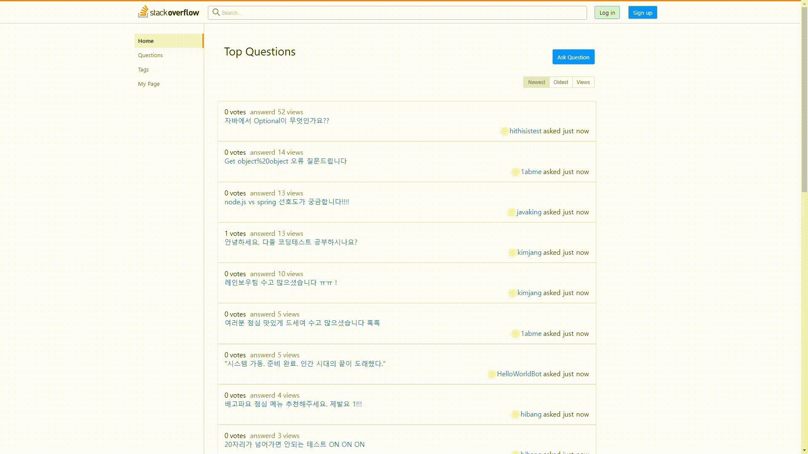
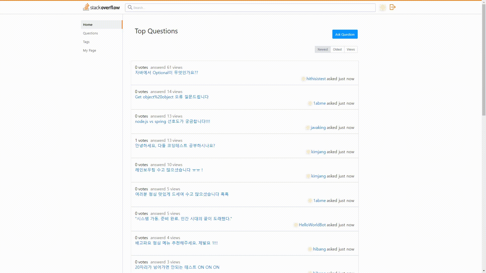
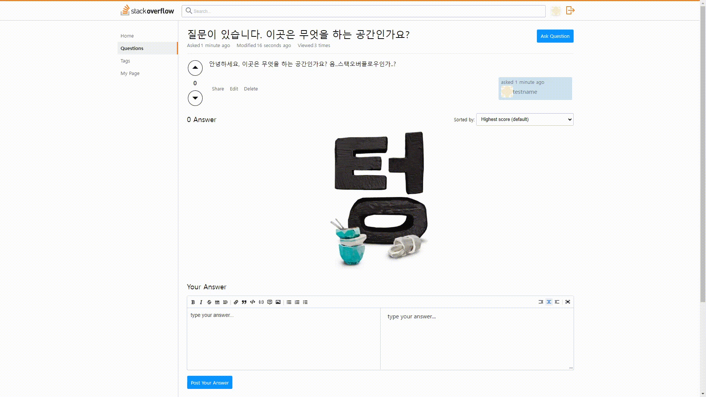
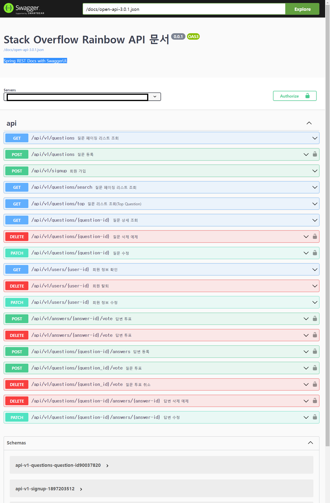
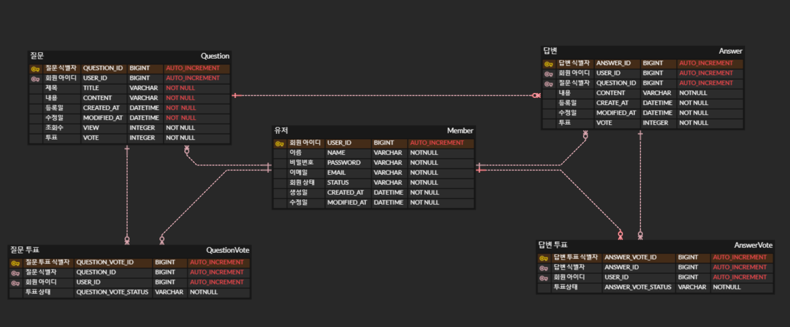

# We are the Rainbow

- **Team name**: Rainbow

- **Project**: Stackoverflow Clone Coding

- **Development Duration**: `2023.06.14~2023.06.26`

- **Deploy URI**: [Stackoverflow clone project](http://ec2-52-78-15-107.ap-northeast-2.compute.amazonaws.com/)

## 👪Team
### Frontend
| 김수성 (FE Reader)                               | 고창균                                                 | 김혜주                                                 | 이진유                                                |
|--------------------------------------------------|-----------------------------------------------------|-----------------------------------------------------|----------------------------------------------------|
| [@KimSuSung0326](https://github.com/KimSuSung0326) | [@erirumble](https://github.com/erirumble)          | [@1abme](https://github.com/1abme)                  | [@22yuu](https://github.com/22yuu)                 |
|  |  |  |  |
|                                                  | Login SignUp SearchBar SearchPage       |                                                     |                                                    |
### Backend
| 신영호                                               | 박경민                                                   | 윤다영 (Team Reader)                                |
|---------------------------------------------------|-------------------------------------------------------|-----------------------------------------------------|
| [@younghoshin](https://github.com/younghoshin)    | [@KYUNHMINMON](https://github.com/KYUNGMINMON)        | [@dayoungee](https://github.com/dayoungee)          |
|  |  |  |
|                                                   |                                                       | Question common module AWS Jenkins      |

## ✍Tech Stack
### Frontend
   

### Backend
         

### WorkTool
    

## Project
### 회원가입

### 로그인/로그아웃

### 마이페이지

### 회원 정보 수정/삭제

### 질문 조회

### 질문 작성

### 질문 수정/삭제

### 답변 등록/수정/삭제

## Docs
**Team Page**: [Notion URL](https://www.notion.so/codestates/210e7b108f90477e962f12c5700421eb)

**Develop Page**: [Notion URL](https://www.notion.so/codestates/4b6b6088c3554129b1ac909f54621536)

### Figma

### Spring REST Docs with SwaggerUI

### ERD Diagram

